# MKT_KSA_Geolocation_Security

نظام تحقق جغرافي وأمني متقدم للإنتاج، مخصص لخدمات Rust ومنصات الوصول الذكي.

<p align="center">
  <a href="https://github.com/mktmansour/MKT-KSA-Geolocation-Security/actions/workflows/rust.yml">
    
  </a>
  <a href="https://github.com/mktmansour/MKT-KSA-Geolocation-Security/actions/workflows/clippy.yml">
    
  </a>
  <a href="https://github.com/mktmansour/MKT-KSA-Geolocation-Security/actions/workflows/codeql.yml">
    
  </a>
  <a href="https://github.com/mktmansour/MKT-KSA-Geolocation-Security/actions/workflows/security-gates.yml">
    
  </a>
</p>

<p align="center">
  <a href="https://crates.io/crates/MKT_KSA_Geolocation_Security">
    
  </a>
  <a href="https://docs.rs/MKT_KSA_Geolocation_Security">
    
  </a>
  <a href="https://crates.io/crates/MKT_KSA_Geolocation_Security">
    
  </a>
  
  
  
</p>


<table align="center">
  <tr>
    <td align="center">
      
    </td>
    <td align="center">
      
    </td>
  </tr>
  <tr>
    <td align="center" colspan="2">
      
    </td>
  </tr>
</table>

> [!WARNING]
> **تنبيه أمني للإصدارات**
> الإصدار **2.0.0** أصبح غير موصى به للإنتاج بعد ظهور ثغرات حرجة عند الاستخدام النهائي.
> الإصدار المعتمد والمستقر حاليًا هو **2.0.1** بعد التقوية الأمنية والتعديلات الهندسية.
> يمنع اعتماد الإصدار 2.0.0 في البيئات النشطة.

## 0. تنبيه سلامة الإصدار

- تم سحب التوصية التشغيلية للإصدار **2.0.0** بعد اكتشاف ثغرات حرجة في مرحلة الاستخدام النهائي.
- الإصدار **2.0.1** هو خط الأساس الإلزامي للترقية، وهو الأكثر استقرارًا ضمن سلسلة هذا المستودع بعد أعمال التحصين والتنظيف.
- تحقق أمان **2.0.1** تم عبر بوابات صارمة: (`fmt`, `clippy -D warnings`, اختبارات كاملة, `cargo audit`) إضافة إلى فحوص GitHub الأمنية (Code Scanning, Dependabot, Secret Scanning).
- أي بيئة ما زالت على **2.0.0** يجب ترقيتها فورًا إلى **2.0.1** مع إعادة التحقق بعد الترقية.
- قوالب التنبيه الأمني الجاهزة للنشر متوفرة في:
  - `docs/security-advisories/SECURITY_ADVISORY_TEMPLATE_EN.md`
  - `docs/security-advisories/SECURITY_ADVISORY_TEMPLATE_AR.md`

## آخر التحديثات والتنبيه الاستراتيجي (2026-03-19)


### تطويرات وتحديثات (اليوم + الأمس + قبل الأمس)

- خط الإصدار المعتمد ما يزال **2.0.1** وكل أعمال التقوية الأخيرة مدرجة ضمن نفس الخط.
- إضافة نشر موحّد لـ `X-Request-ID` على مستوى التطبيق لضمان استمرارية التتبع في الأخطاء والنجاحات.
- إضافة حظر أمني تكيفي عبر AI مع دلالات الأسباب وإرجاع `Retry-After` عند المنع.
- إضافة فرض صارم لمفتاح API مع مقارنة ثابتة الزمن وتوحيد عقود أخطاء API البنيوية.
- إضافة سجلات ارتباط أمني للحالات المرفوضة/الممنوعة، وسجلات نجاح تتضمن زمن التنفيذ `latency`.
- إضافة تشديد تشغيلي حسب الملف الأمني (`strict` و `ultra-strict`) مع تحقق إقلاع أكثر صرامة.
- تم إيقاف التشغيل الدخاني الآلي بنمط CI Matrix داخل المستودع، وأصبح التنفيذ العميق عند الطلب.
- إضافة اختبارات تكامل لانتشار `request_id` عبر عدة endpoints واختبار `trace_id` في الاستجابات الناجحة.

- الإصدار المستهدف حاليًا هو **2.0.1** بسبب الإصلاحات الأمنية والهندسية.
- تم إكمال التقوية الأمنية والتنظيف المعماري على فرع `main`.
- مسار قاعدة البيانات التشغيلي أصبح SQLite محصنًا (`tokio-rusqlite`) مع ترحيلات (migrations).
- تم توحيد التحقق JWT وتحديد المعدل لجميع مسارات API بشكل مركزي.
- تم حذف وحدة Dashboard والوثائق القديمة المتضاربة لتقليل الانحراف الأمني/التوثيقي.
- تم اعتماد نهج نظافة مستودع صارم مع خريطة أدوار ملفات محدثة.

### حالة التحقق من التنفيذ الفعلي (2026-03-19)

- تمت إضافة تقوية AI تكيفية مع كشف اندفاع الحركة (`soft`/`hard`) وعتبة حظر ديناميكية ومؤشرات أكثر صرامة لمسار `smart_access`.
- تم تثبيت عقد المصادقة عمليًا عبر التحقق من JWT أولاً ثم الحجب التكيفي، لمنع أي انحراف غير مقصود في مسارات `401` المتوقعة.
- تمت إضافة حساب ديناميكي لـ `Retry-After` في حالات تحديد المعدل بدل القيمة الثابتة.
- تمت إضافة مفاتيح ضبط تشغيل متقدمة لمهلات/سعة HTTP عبر البيئة (`HTTP_CLIENT_REQUEST_TIMEOUT_SECONDS` و`HTTP_KEEP_ALIVE_SECONDS` و`HTTP_MAX_CONNECTIONS` وغيرها).
- تمت إزالة سكربتات الإجهاد الأمني الدورية والـ workflows المرتبطة بها من خط الأساس داخل المستودع، وأصبحت الجولات العميقة تُنفّذ عند الطلب فقط.
- تمت إعادة التحقق الصارم للمسار الكامل (`fmt` و`clippy -D warnings` والاختبارات الكاملة والتنفيذ الحي) بدون `5xx` في أحدث جولات التقوية.

## سياسة الصيانة (مهم)

- هذا المستودع دخل وضع **صيانة أمنية فقط**.
- **لا يوجد تطوير ميزات جديدة** لهذا المشروع.
- التحديثات القادمة هنا ستكون فقط: إصلاحات أمنية وتصحيحات استقرار حرجة.
- يجري تطوير مشروع خليفة سيادي جديد وسيتم الإعلان عنه في 2026.
- المشروع الخليفة يُبنى من الصفر بالكامل مع **صفر تبعيات خارجية** وحزم سيادية داخلية.

### إعلان برنامج المشروع الخليفة


## ملاحظة مجتمعية


[](https://crates.io/crates/MKT_KSA_Geolocation_Security)
[](https://github.com/mktmansour/MKT-KSA-Geolocation-Security/stargazers)

- تم تحميل الحزمة آلاف المرات.
- مستوى التفاعل (تعليقات/ردود/تقييمات) أقل بكثير من المتوقع.
- الملاحظات التقنية الأمنية من المستخدمين مرحب بها بشكل كبير.

### التصويت واللايكات والتعليقات

- التصويت والتفاعل بالرموز (👍 👎 ❤️ 🚀): [Issue #50](https://github.com/mktmansour/MKT-KSA-Geolocation-Security/issues/50)
- كتابة التعليقات وملاحظات التكامل: [Issue #50](https://github.com/mktmansour/MKT-KSA-Geolocation-Security/issues/50)

## المحتويات

- 🛡️ [0. تنبيه سلامة الإصدار](#0-تنبيه-سلامة-الإصدار)
- 🎯 [1. وظيفة المشروع](#1-وظيفة-المشروع)
- 🧭 [1.1 هدف المشروع](#11-هدف-المشروع)
- ✨ [1.2 مميزات المشروع](#12-مميزات-المشروع)
- 🏛️ [1.3 الجهات المستهدفة](#13-الجهات-المستهدفة)
- 🔐 [2. الوضع التشغيلي والأمني](#2-الوضع-التشغيلي-والأمني)
- 🗂️ [3. خريطة أدوار المستودع كاملة](#3-خريطة-أدوار-المستودع-كاملة)
- 🔄 [4. الترابط وتدفق التحكم](#4-الترابط-وتدفق-التحكم)
- 🧱 [4.1 مخطط هيكلة المشروع](#41-مخطط-هيكلة-المشروع)
- 🌐 [5. مرجع API وطرق الاستدعاء](#5-مرجع-api-وطرق-الاستدعاء)
- ⚙️ [6. متغيرات البيئة](#6-متغيرات-البيئة)
- 🧪 [7. البناء والتشغيل والتحقق](#7-البناء-والتشغيل-والتحقق)
- 🛠️ [8. آخر الإصلاحات والتقويات](#8-آخر-الإصلاحات-والتقويات)
- 🔌 [9. الاستخدام كمكتبة و C-ABI](#9-الاستخدام-كمكتبة-و-c-abi)
- 📚 [10. تفاصيل مسؤوليات المجلدات والملفات](#10-تفاصيل-مسؤوليات-المجلدات-والملفات)
- 🧠 [11. مراجعة هندسية عميقة لمجلد src](#11-مراجعة-هندسية-عميقة-لمجلد-src)
- 👨‍💻 [12. دليل المطور](#12-دليل-المطور)
- 🤖 [13. دور الذكاء الاصطناعي والاستخبارات](#13-دور-الذكاء-الاصطناعي-والاستخبارات)

## ويكي المشروع (ثنائي اللغة)

- الصفحة الإنجليزية: [docs/wiki/en/Home.md](docs/wiki/en/Home.md)
- الصفحة العربية: [docs/wiki/ar/Home.md](docs/wiki/ar/Home.md)
- فهرس المصدر: [docs/wiki/README.md](docs/wiki/README.md)

## 1. وظيفة المشروع


`MKT_KSA_Geolocation_Security` يجمع عدة إشارات ثقة ضمن قرار أمني موحّد:

- التحقق الجغرافي
- تحليل الشذوذ السلوكي
- تحليل بصمة الجهاز
- تحليل مخاطر الشبكة (Proxy/VPN)
- تحليل شذوذ بيانات الحساسات
- تدقيق اتساق الطقس مع السياق
- تحقق وصول ذكي مركب

طبقة API تعمل عبر Actix Web، بينما المحركات الأساسية قابلة لإعادة الاستخدام كمكتبة Rust.

### 1.1 هدف المشروع

- تقديم نواة أمان جغرافي صارمة بمستوى هندسي عالٍ للقطاعات السيادية والمؤسسية.
- تقليل مخاطر الاحتيال عبر دمج إشارات متعددة في قرار ثقة واحد قابل للتدقيق.
- الحفاظ على وضع أمني ثابت وقابل للمراجعة في بيئات الإنتاج.

### 1.2 مميزات المشروع

- تقييم ثقة متعدد الإشارات: الموقع، السلوك، الجهاز، الشبكة، الحساسات، الطقس.
- تحكم مركزي بالمصادقة: تحقق JWT مع تحديد معدل لكل IP.
- وضع تشغيل محصن: SQLite فقط مع إدارة المخطط عبر الترحيلات.
- إدارة أسرار آمنة وتوليد مفاتيح داخلية وقت التشغيل.
- نمط تكامل مزدوج: API وخيارات استخدام كمكتبة داخلية.

### 1.3 الجهات المستهدفة

- الجهات السيادية والحكومية.
- المؤسسات المالية وأنظمة المدفوعات الرقمية.
- مشغلو البنية التحتية الحرجة (الطاقة، النقل، المرافق).
- منصات الرعاية الصحية والهوية الحساسة.
- فرق هندسة الأمن التي تبني خدمات مدن ذكية مقاومة للاحتيال.

## 2. الوضع التشغيلي والأمني


- اللغة: Rust 2021
- إطار الويب: Actix Web
- runtime غير متزامن: Tokio
- قاعدة البيانات التشغيلية: SQLite فقط (`DATABASE_URL=sqlite://...`)
- JWT: فك/تحقق مركزي عبر `JwtManager`
- Rate Limiting: فحص مركزي لكل IP قبل تنفيذ منطق المسار
- حارس AI تكيفي: تقييم مخاطر مركزي للمسار/الحمولة مع حظر مؤقت وإرجاع `Retry-After`
- ربط الطلبات: نشر موحّد لـ `X-Request-ID` عبر مسارات النجاح والخطأ
- غلاف تتبع النجاح: استجابات JSON الناجحة تتضمن `trace_id` و `data`
- أسرار المحركات الداخلية: تُولَّد عشوائيًا أثناء التشغيل (بدون أي مفاتيح ثابتة داخل الكود)
- إدارة الأسرار: `secrecy` + `zeroize`
- التوقيع: HMAC-SHA512/HMAC-SHA384
- ترحيلات القاعدة: SQL versioned في `src/db/migrations`

## 3. خريطة أدوار المستودع كاملة


### ملفات الجذر

| المسار | الدور |
|---|---|
| `Cargo.toml` | تعريف الحزمة والتبعيات والميزات وأنواع البناء |
| `Cargo.lock` | تثبيت نسخ التبعيات بشكل حتمي |
| `rust-toolchain.toml` | حوكمة نسخة Rust و MSRV |
| `README.md` | التوثيق الأساسي بالإنجليزية |
| `README_AR.md` | التوثيق الأساسي بالعربية |
| `SECURITY.md` | سياسة الإبلاغ الأمني |
| `CHANGELOG.md` | سجل الإصدارات والتعديلات |
| `CONTRIBUTING.md` | دليل المساهمة والمعايير |
| `Dockerfile` | بناء صورة التشغيل بالحاوية |
| `audit.toml` | إعدادات `cargo-audit` |
| `cbindgen.toml` | إعداد توليد رؤوس C-ABI |
| `.env.example` | نموذج متغيرات البيئة |
| `GeoLite2-City-Test.mmdb` | قاعدة بيانات GeoIP تجريبية للاختبارات |

### المجلدات

| المجلد | الدور |
|---|---|
| `.github/` | CI/CD و CodeQL وحوكمة المراجعات |
| `docs/` | تقارير التقوية الأمنية وحوكمة الملفات |
| `examples/` | أمثلة استخدام المكتبة |
| `scripts/` | سكربتات الصيانة و CI |
| `src/` | الكود الإنتاجي الرئيسي |
| `tests/` | اختبارات التكامل وسطح الأمان |
| `target/` | مخلفات بناء محلية (ليست مصدرًا) |

### ملفات الحوكمة الأمنية الجديدة (2026-03-17)

| المسار | الدور |
|---|---|
| `tests/api_request_id_propagation_integration.rs` | اختبارات تكامل لانتشار request-id وتتبع استجابات النجاح |

### تفصيل `src/`

| المسار | الوظيفة | الترابط |
|---|---|---|
| `src/main.rs` | تهيئة التطبيق وتشغيل الخادم | يبني `AppState` ويسجل المسارات |
| `src/lib.rs` | واجهة المكتبة وإعادة التصدير | يعرّض `api/core/db/security/utils` |
| `src/app_state.rs` | الحالة المشتركة وقت التشغيل | يتم حقنها داخل كل handlers |
| `src/api/mod.rs` | تسجيل المسارات + مصادقة مركزية | يستدعي الوحدات الفرعية |
| `src/api/*.rs` | handlers حسب المجال | تستخدم `authorize_request` ثم core/db |
| `src/core/*.rs` | المحركات والتحليل الدوميني | تُستهلك من API والاختبارات |
| `src/db/mod.rs` | ربط وحدات قاعدة البيانات | يعرّض models/crud/migrations |
| `src/db/models.rs` | نماذج البيانات | تُستخدم في CRUD وAPI |
| `src/db/crud.rs` | عمليات SQLite | تُستخدم في auth/alerts/bootstrapping |
| `src/db/migrations.rs` + SQL | إدارة نسخة المخطط | تُنفذ عند الإقلاع |
| `src/security/*.rs` | JWT, policy, ratelimit, validation, secrets/signing | مستخدمة عرضيًا عبر المشروع |
| `src/security/ai_guard.rs` | حارس مخاطر تكيفي للطلبات مع إدارة السمعة والحظر المؤقت | يُستدعى من بوابة التفويض المركزية |
| `src/utils/*.rs` | أدوات مساعدة رياضية/كاش/تسجيل | دعم عام للمحركات |

## 4. الترابط وتدفق التحكم


1. `main.rs` يحمّل الإعدادات ويتحقق من القيم الأمنية الحرجة (`JWT_SECRET`, DB policy).
2. `main.rs` يهيّئ كل المحركات والخدمات ويبني `AppState`.
3. الطلب يصل إلى `/api/...` عبر المسارات المسجلة في `src/api/mod.rs`.
4. `authorize_request()` يفرض بالتسلسل:
   - وجود `Authorization: Bearer ...`
   - فحص معدل الطلبات
  - تحقق مفتاح API عند تفعيله
  - فحص المخاطر عبر الحارس التكيفي AI
   - فك والتحقق من JWT
5. يتم تمرير الطلب للمحرك/القاعدة المناسبة.
6. تعاد الاستجابة JSON أو خطأ HTTP مناسب.

### 4.1 مخطط هيكلة المشروع


هذا المخطط يمثل البنية الفعلية للمستودع من طبقة الدخول وواجهات API حتى طبقات الأمان والمحركات الأساسية ووحدات البيانات والمساندة.

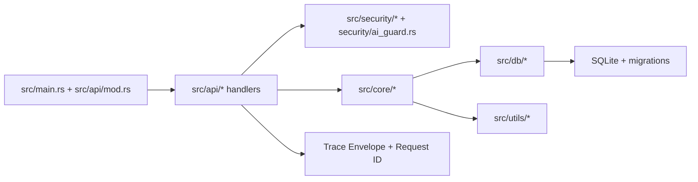

## 5. مرجع API وطرق الاستدعاء


Base URL: `http://127.0.0.1:8080`
جميع المسارات تحت `/api`.
كل المسارات تتطلب: `Authorization: Bearer <JWT>`.

### 5.1 جدول المسارات

| الطريقة | المسار | الملف | الوظيفة |
|---|---|---|---|
| `GET` | `/api/users/{id}` | `src/api/auth.rs` | جلب مستخدم بـ UUID (self/admin) |
| `POST` | `/api/geo/resolve` | `src/api/geo.rs` | تحقق جغرافي متقاطع |
| `POST` | `/api/device/resolve` | `src/api/device.rs` | تحليل بصمة الجهاز |
| `POST` | `/api/behavior/analyze` | `src/api/behavior.rs` | تحليل مخاطر السلوك |
| `POST` | `/api/sensors/analyze` | `src/api/sensors.rs` | تحليل شذوذ الحساسات |
| `POST` | `/api/network/analyze` | `src/api/network.rs` | تحليل الشبكة وكشف الإخفاء |
| `POST` | `/api/alerts/trigger` | `src/api/alerts.rs` | إنشاء وتخزين تنبيه أمني |
| `POST` | `/api/weather/summary` | `src/api/weather.rs` | ملخص تحقق الطقس |
| `POST` | `/api/smart_access/verify` | `src/api/smart_access.rs` | قرار وصول ذكي مركب |

### 5.2 أمثلة استدعاء

جلب مستخدم:

```bash
curl -X GET "http://127.0.0.1:8080/api/users/<uuid>" \
  -H "Authorization: Bearer <jwt>"
```

تحقق جغرافي:

```bash
curl -X POST "http://127.0.0.1:8080/api/geo/resolve" \
  -H "Authorization: Bearer <jwt>" \
  -H "Content-Type: application/json" \
  -d '{
    "ip_address":"8.8.8.8",
    "gps_data":[24.7136,46.6753,8,1.0],
    "os_info":"ios",
    "device_details":"iphone-15",
    "environment_context":"mobile-4g",
    "behavior_input":{
      "user_id":"00000000-0000-0000-0000-000000000000",
      "event_type":"login",
      "ip_address":"8.8.8.8",
      "device_id":"device-1",
      "timestamp":"2026-03-15T00:00:00Z"
    }
  }'
```

تحليل الشبكة:

```bash
curl -X POST "http://127.0.0.1:8080/api/network/analyze" \
  -H "Authorization: Bearer <jwt>" \
  -H "Content-Type: application/json" \
  -d '{"ip":"1.1.1.1","conn_type":"WiFi"}'
```

إطلاق تنبيه:

```bash
curl -X POST "http://127.0.0.1:8080/api/alerts/trigger" \
  -H "Authorization: Bearer <jwt>" \
  -H "Content-Type: application/json" \
  -d '{
    "entity_id":"00000000-0000-0000-0000-000000000000",
    "entity_type":"user",
    "alert_type":"suspicious_login",
    "severity":"high",
    "details":{"ip":"8.8.8.8","reason":"impossible_travel"}
  }'
```

تحقق الوصول الذكي:

```bash
curl -X POST "http://127.0.0.1:8080/api/smart_access/verify" \
  -H "Authorization: Bearer <jwt>" \
  -H "Content-Type: application/json" \
  -d '{
    "geo_input":["8.8.8.8",[24.7136,46.6753,8,1.0]],
    "behavior_input":{
      "user_id":"00000000-0000-0000-0000-000000000000",
      "event_type":"entry_attempt",
      "ip_address":"8.8.8.8",
      "device_id":"device-1",
      "timestamp":"2026-03-15T00:00:00Z"
    },
    "os_info":"ios",
    "device_details":"iphone-15",
    "env_context":"office-gate"
  }'
```

## 6. متغيرات البيئة


| المتغير | إلزامي | الوصف | مثال |
|---|---|---|---|
| `API_KEY` | نعم | مفتاح التطبيق في طبقة الإعداد | `API_KEY=change_me` |
| `JWT_SECRET` | نعم | سر JWT بطول 32+ | `JWT_SECRET=32+_chars_secret_here` |
| `DATABASE_URL` | موصى به | مسار SQLite؛ بدونه تعيد مسارات DB حالة 503 | `DATABASE_URL=sqlite://data/app.db` |
| `SECURITY_PROFILE` | اختياري | نمط الصرامة الأمنية (`strict` أو `ultra`) | `SECURITY_PROFILE=ultra` |
| `RATE_LIMIT_MAX_REQUESTS` | اختياري | عدد الطلبات المسموح لكل IP في الدقيقة | `RATE_LIMIT_MAX_REQUESTS=60` |
| `AI_GUARD_BLOCK_THRESHOLD` | اختياري | عتبة حظر AI الأساسية (الأقل = أكثر صرامة) | `AI_GUARD_BLOCK_THRESHOLD=55` |
| `AI_GUARD_BURST_WINDOW_SECONDS` | اختياري | نافذة كشف الاندفاع لحارس AI التكيفي | `AI_GUARD_BURST_WINDOW_SECONDS=10` |
| `AI_GUARD_BURST_SOFT_LIMIT` | اختياري | حد اندفاع مرن قبل رفع درجة الخطر | `AI_GUARD_BURST_SOFT_LIMIT=24` |
| `AI_GUARD_BURST_HARD_LIMIT` | اختياري | حد اندفاع صارم للحظر العدائي | `AI_GUARD_BURST_HARD_LIMIT=60` |
| `HTTP_CLIENT_REQUEST_TIMEOUT_SECONDS` | اختياري | مهلة الطلب قبل 408 | `HTTP_CLIENT_REQUEST_TIMEOUT_SECONDS=30` |
| `HTTP_CLIENT_DISCONNECT_TIMEOUT_SECONDS` | اختياري | مهلة معالجة انقطاع العميل | `HTTP_CLIENT_DISCONNECT_TIMEOUT_SECONDS=10` |
| `HTTP_KEEP_ALIVE_SECONDS` | اختياري | مهلة Keep-Alive | `HTTP_KEEP_ALIVE_SECONDS=10` |
| `HTTP_WORKERS` | اختياري | عدد عمال Actix | `HTTP_WORKERS=8` |
| `HTTP_MAX_CONNECTIONS` | اختياري | الحد الأعلى للاتصالات المتزامنة | `HTTP_MAX_CONNECTIONS=50000` |
| `HTTP_MAX_CONNECTION_RATE` | اختياري | معدل قبول الاتصالات | `HTTP_MAX_CONNECTION_RATE=1024` |
| `HTTP_BACKLOG` | اختياري | حجم backlog للسوكيت | `HTTP_BACKLOG=4096` |
| `HTTP_SHUTDOWN_TIMEOUT_SECONDS` | اختياري | مهلة الإيقاف الآمن | `HTTP_SHUTDOWN_TIMEOUT_SECONDS=45` |
| `BOOTSTRAP_ADMIN_PASSWORD_HASH` | اختياري | عند ضبطه يتم إنشاء مستخدم bootstrap-admin عند الإقلاع بالهاش الممرر | `BOOTSTRAP_ADMIN_PASSWORD_HASH=<argon2_hash>` |
| `LOG_LEVEL` | اختياري | مستوى السجلات | `LOG_LEVEL=info` |
| `GEO_PROVIDER` | اختياري | اختيار مزود الموقع | `GEO_PROVIDER=ipapi` |

## 7. البناء والتشغيل والتحقق


```bash
cargo fmt --all -- --check
cargo clippy --all-targets --all-features -- -D warnings
cargo test --all
```

تشغيل:

```bash
API_KEY=change_me \
JWT_SECRET=replace_with_a_long_secret_32_chars_min \
DATABASE_URL=sqlite://data/app.db \
BOOTSTRAP_ADMIN_PASSWORD_HASH=replace_with_hash_if_needed \
cargo run
```

## 8. آخر الإصلاحات والتقويات


نطاق الإصلاحات والتطويرات في 2.0.1 يشمل بشكل كامل:

- التقوية الأمنية: اعتماد SQLite المحصن فقط مع فرض الترحيلات.
- التقوية الأمنية: توحيد التحقق JWT وتحديد المعدل لكل IP عبر مسار مصادقة مركزي.
- التقوية الأمنية: توليد أسرار المحركات داخليًا وقت التشغيل وإلغاء أي أسرار ثابتة داخل الكود.
- التقوية الأمنية: جعل seed لمستخدم bootstrap-admin اختياريًا فقط عبر `BOOTSTRAP_ADMIN_PASSWORD_HASH`.
- الإصلاحات التشغيلية: حذف وحدة Dashboard بالكامل من سطح API.
- الإصلاحات التشغيلية: استبدال السلوك الوهمي في بعض المسارات بمنطق فعلي مربوط بالمحركات/القاعدة.
- الإصلاحات التشغيلية: إضافة مخزن تنبيهات في الذاكرة بحد أعلى لمنع التضخم.
- الحوكمة ونظافة المستودع: إزالة التقارير القديمة غير المتوافقة مع الوضع الحالي.
- الحوكمة ونظافة المستودع: إضافة وثيقة مرجعية نهائية لأدوار الملفات.
- الحوكمة ونظافة المستودع: إعادة بناء التوثيقين الأساسيين (إنجليزي/عربي) بصياغة هندسية صارمة.
- تجربة التوثيق: إضافة بنرات رسومية لكل قسم مع كتابة اسم القسم داخل البنر.
- التحقق والجودة: نجاح فحوص `fmt` و`clippy -D warnings` و`test` على مسار هذا التحديث.
- التقوية الأمنية (2026-03-19): تطوير AI Guard ليدعم التكيّف مع burst وعتبات مخاطرة ديناميكية ومسار `smart_access` أكثر صرامة.
- التقوية الأمنية (2026-03-19): ضبط ترتيب التفويض المركزي للحفاظ على دلالات JWT قبل الحظر التكيفي.
- التقوية الأمنية (2026-03-19): تحويل `Retry-After` إلى قيمة ديناميكية مرتبطة بحالة IP.
- التقوية التشغيلية (2026-03-19): إضافة ضبط بيئي لمهلات/سعة خادم HTTP في الضغط العالي.

تم توثيق التحديثات الأمنية والهندسية الحديثة في:

- `docs/SECURITY_HARDENING_2026-03-15.md`
- `docs/GITHUB_ADVANCED_SCAN_2026-03-15.md`
- `docs/REPOSITORY_FILE_ROLES_2026-03-15.md`
- `CHANGELOG.md`

## 9. الاستخدام كمكتبة و C-ABI


مخرجات البناء التي يوفّرها المشروع:

- `rlib` للاستخدام المباشر داخل Rust.
- `cdylib` للتكامل عبر C-ABI.
- `staticlib` للربط الثابت.

### 9.1 مصفوفة دعم اللغات (النطاق الفعلي)

| اللغة | مستوى الدعم | طريقة الاستخدام |
|---|---|---|
| Rust | دعم مباشر | استدعاء API الخاص بالحزمة مباشرة |
| C / C++ | دعم مباشر عبر C-ABI | استخدام Header + مكتبة ديناميكية/ثابتة |
| Python / Go / C# / Java / Node.js / غيرها | دعم غير مباشر عبر FFI | إنشاء Binding خاص باللغة فوق C-ABI |

مهم: المشروع لا يوفّر SDK جاهزًا لكل لغة بشكل أصلي. دعم اللغات غير Rust يتم عبر طبقة C-ABI.

### 9.2 واجهة C-ABI المصدّرة حاليًا

الواجهة المصدّرة حاليًا مقصودة ومحدودة:

- `generate_adaptive_fingerprint`
- `free_fingerprint_string`

وهذه الدوال موجودة في `src/core/device_fp.rs` ويتم إعلانها عبر سياسة `cbindgen.toml`.

### 9.3 خطوات التوليد والاستدعاء

توليد Header:

```bash
cbindgen --config cbindgen.toml --crate MKT_KSA_Geolocation_Security --output mkt_ksa_geo_sec.h
```

بناء المكتبة:

```bash
cargo build --release
```

بعدها يمكن الاستدعاء مباشرة من C/C++، أو من اللغات الأخرى عبر طبقة C-FFI (مثل: Python `ctypes`، Go `cgo`، C# `DllImport`).

### 9.4 لماذا لم يكن هذا واضحًا سابقًا

التوثيق السابق كان مركزًا على المعمارية والأمان وسلوك API. تمت الآن إضافة هذا القسم لشرح حدود دعم اللغات وطريقة الاستدعاء بشكل صريح.

## 10. تفاصيل مسؤوليات المجلدات والملفات

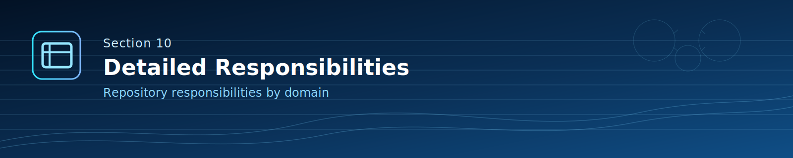

### `.github/`

- `workflows/`: خطوط CI للتحقق (`rust`, `clippy`, `codeql`, `security-gates`, وإصدار النسخ).
- `actions/secure-workspace/action.yml`: خطوة مشتركة لتقوية بيئة العمل في CI.
- `codeql/codeql-config.yml`: ضبط نطاق فحص CodeQL.
- `CODEOWNERS`: ملكية المراجعة للمسارات الحساسة.
- `pull_request_template.md`: قائمة تحقق أمنية وجودة عند فتح PR.

### `docs/`

- `SECURITY_HARDENING_2026-03-15.md`: تقرير تنفيذ التقوية الأمنية.
- `GITHUB_ADVANCED_SCAN_2026-03-15.md`: ملخص الفحص المتقدم والمعالجات.
- `REPOSITORY_FILE_ROLES_2026-03-15.md`: المرجع الرسمي لأدوار الملفات الحالية.
- `images/cover-mkt-ksa.svg`: الصورة الرئيسية للتوثيق.
- `images/banners/section-01.svg` ... `section-13.svg`: بنرات مخصصة لكل قسم.

### `scripts/`

- `ci/cleanup_workspace.sh`: تنظيف منهجي لبيئة CI/المحلي من آثار الكاش والملفات المتبقية.

### `examples/`

- `using_lib.rs`: مثال عملي لاستخدام المكتبة ومحركاتها.

### `tests/`

- `api_integration_auth_rate_limit_db.rs`: اختبار تكاملي للمصادقة + تحديد المعدل + قاعدة البيانات.
- `api_security_surface_integration.rs`: اختبار سطح API الأمني وسلوك burst.
- `support/mod.rs`: أدوات مساعدة مشتركة للاختبارات.

### `src/api/`

- `mod.rs`: تسجيل المسارات وتوحيد مسار التفويض.
- `auth.rs`: جلب مستخدم مع فحص claims/roles.
- `geo.rs`: التحقق الجغرافي المتقاطع.
- `device.rs`: تحليل بصمة الجهاز.
- `behavior.rs`: التحليل السلوكي.
- `network.rs`: تحليل الثقة الشبكية وكشف الإخفاء.
- `sensors.rs`: تحليل شذوذ الحساسات.
- `alerts.rs`: إنشاء التنبيهات وتخزينها (ذاكرة + قاعدة بيانات).
- `weather.rs`: ملخص الطقس والتحقق.
- `smart_access.rs`: قرار الوصول الذكي المركب.

### `src/core/`

- `geo_resolver.rs`: تحليل/حل الموقع وتوقيع النتائج.
- `device_fp.rs`: توليد وتحليل بصمة الجهاز التكيفية.
- `behavior_bio.rs`: التحليل السلوكي وحساب المخاطر.
- `network_analyzer.rs`: كشف proxy/vpn ونمط الاتصال.
- `sensors_analyzer.rs`: كشف شذوذ قراءات الحساسات.
- `weather_val.rs`: مزودات الطقس والتحقق من الاتساق.
- `cross_location.rs`: منسق التحقق متعدد الإشارات.
- `composite_verification.rs`: محرك السياسات المركبة للوصول.
- `history.rs`: منطق التاريخ وكشف الشذوذ الزمني.
- `mod.rs`: تصدير وحدات النواة.

### `src/db/`

- `models.rs`: تعريف نماذج البيانات.
- `crud.rs`: عمليات SQLite غير المتزامنة.
- `migrations.rs`: تشغيل الترحيلات.
- `migrations/0001_initial.sql`: المخطط الأساسي.
- `migrations/0002_indexes.sql`: فهارس وتحسين الأداء.
- `mod.rs`: تصدير وحدات قاعدة البيانات.

### `src/security/`

- `jwt.rs`: إنشاء/تحقق الرموز وسياسات claims.
- `ratelimit.rs`: ضوابط الحد من المعدل لكل IP.
- `policy.rs`: محرك السياسات والصلاحيات والحالات.
- `input_validator.rs`: التطبيع والتنقية والتحقق من المدخلات.
- `secret.rs`: حاويات آمنة للقيم الحساسة.
- `signing.rs`: التوقيع والتحقق HMAC.
- `mod.rs`: تصدير وحدات الأمان.

### `src/utils/`

- `cache.rs`: أدوات التخزين المؤقت.
- `helpers.rs`: وظائف مساعدة عامة.
- `logger.rs`: مساعدات التسجيل.
- `precision.rs`: حسابات الدقة الرياضية/الزمنية.
- `mod.rs`: تصدير وحدات الأدوات.

### ملفات الجذر التشغيلية

- `Cargo.toml`: تعريف الحزمة وسياسة التبعيات والإصدار الحالي (`2.0.1`).
- `Cargo.lock`: تثبيت شجرة التبعيات.
- `README.md` و`README_AR.md`: المرجع الأساسي للتوثيق.
- `CHANGELOG.md`: سجل التعديلات حسب الإصدارات.
- `SECURITY.md`: سياسة الإبلاغ الأمني.
- `CONTRIBUTING.md`: معايير وإجراءات المساهمة.
- `Dockerfile`: وصف بيئة التشغيل بالحاوية.
- `audit.toml`: إعدادات تدقيق التبعيات.
- `cbindgen.toml`: إعدادات توليد واجهة C-ABI.
- `GeoLite2-City-Test.mmdb`: ملف اختبار جغرافي مستخدم في مسارات مرتبطة بالتحقق الجغرافي.

## 11. مراجعة هندسية عميقة لمجلد src

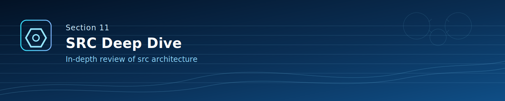

هذا القسم يراجع كل الوحدات الرئيسية تحت `src/` هندسيًا، وليس `core/` فقط.

### 11.1 خريطة المسؤوليات داخل `src`

<div align="center">

| الوحدة | الدور الأساسي | التأثير الأمني | التأثير التشغيلي |
|---|---|---|---|
| `src/main.rs` | تهيئة الخدمات وتشغيل الخادم | يفرض تحقق الإقلاع وسياسة الأسرار | يحدد دورة حياة العملية |
| `src/lib.rs` | تصدير واجهة المكتبة | يقلل سطح التعريض غير الضروري | يتيح الاستخدام كمكتبة |
| `src/app_state.rs` | حاوية الحالة المشتركة | يمنع تشتت مكونات الأمان | ينسق الوصول للمحركات |
| `src/api/` | واجهات HTTP وربط المسارات | يطبق التفويض المركزي | يدير مسار المرور الخارجي |
| `src/core/` | محركات التحقق والتحليل | ينتج قرارات المخاطر والثقة | يقود زمن قرار النظام |
| `src/db/` | النماذج والعمليات والترحيلات | يحفظ اتساق البيانات | يضمن موثوقية التخزين |
| `src/security/` | JWT والسياسات وتحديد المعدل والتوقيع | خط الإنفاذ الأساسي | يتحكم بقبول/رفض الطلب |
| `src/utils/` | أدوات الدعم المشتركة | يقلل الأنماط غير الآمنة المكررة | يدعم السلوك الحتمي |

</div>

### 11.2 `src/main.rs` وتنسيق الإقلاع

- تحميل متغيرات البيئة الحرجة.
- التحقق من إعدادات الأمن قبل التشغيل.
- تهيئة المحركات وقاعدة البيانات والمسارات.
- بناء `AppState` وبدء خادم Actix.

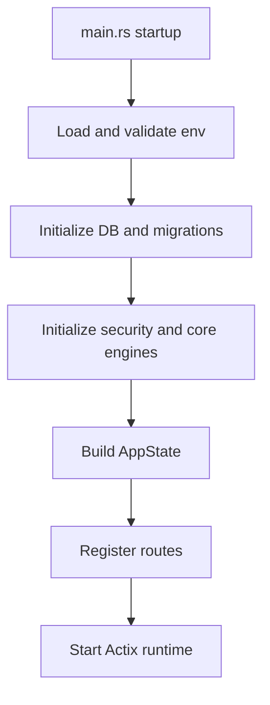

### 11.3 `src/api/` دورة معالجة الطلب

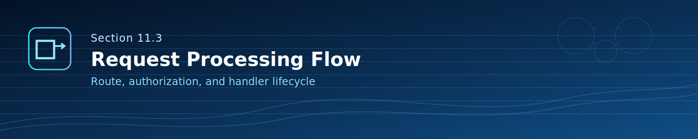

- ترجمة عقود API الخارجية إلى استدعاءات داخلية.
- تنفيذ `authorize_request()` قبل منطق المسار.
- تمرير الحمولة للوحدة المناسبة مع استجابة HTTP واضحة.

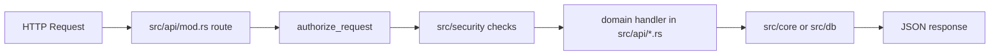

### 11.4 `src/core/` محركات الثقة متعددة الإشارات

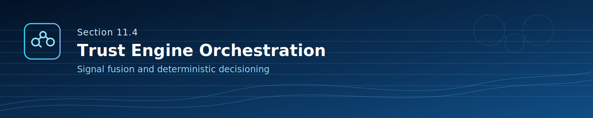

- يحتوي منطق التحليل الجغرافي والسلوكي وبصمة الجهاز والشبكة والحساسات والطقس والتحقق المركب.
- يدمج الإشارات لإخراج قرار حتمي قابل للتدقيق.

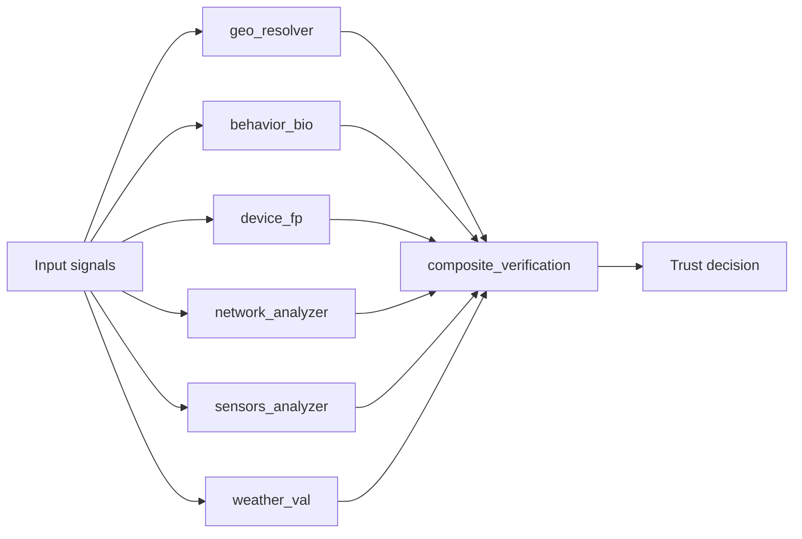

### 11.5 `src/db/` حدود التخزين

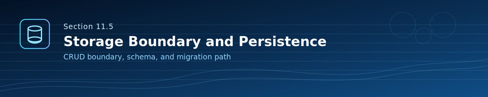

- إدارة نسخة المخطط عبر migrations.
- تنفيذ عمليات CRUD غير المتزامنة.
- عزل طبقة التخزين عن واجهات API.

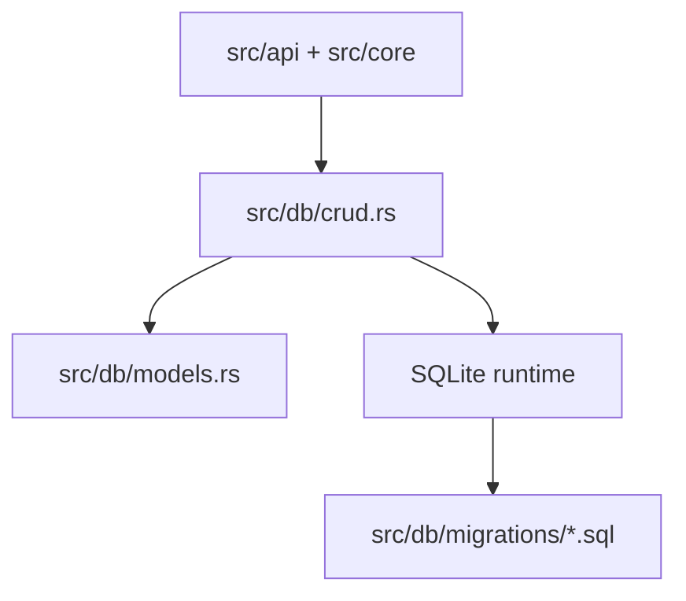

### 11.6 `src/security/` دور الأمن وطرق عمله

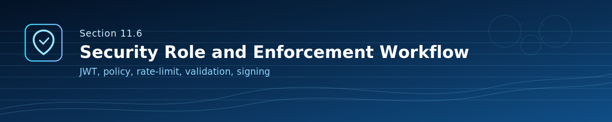

- `jwt.rs`: إصدار/تحقق الرموز وفحص claims.
- `policy.rs`: قواعد الصلاحيات والحالة الأمنية.
- `ratelimit.rs`: منع الإساءة عبر الحد لكل IP.
- `input_validator.rs`: تطبيع وتنقية المدخلات.
- `secret.rs` و`signing.rs`: حماية القيم الحساسة والتوقيع/التحقق.

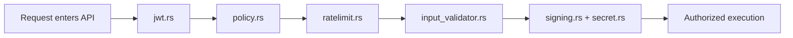

### 11.7 `src/utils/` طبقة الدعم الحتمي

- التخزين المؤقت والدقة الرياضية/الزمنية والسجلات والمساعدات العامة.
- تخفيف التكرار وتحسين الاتساق عبر كل الوحدات.

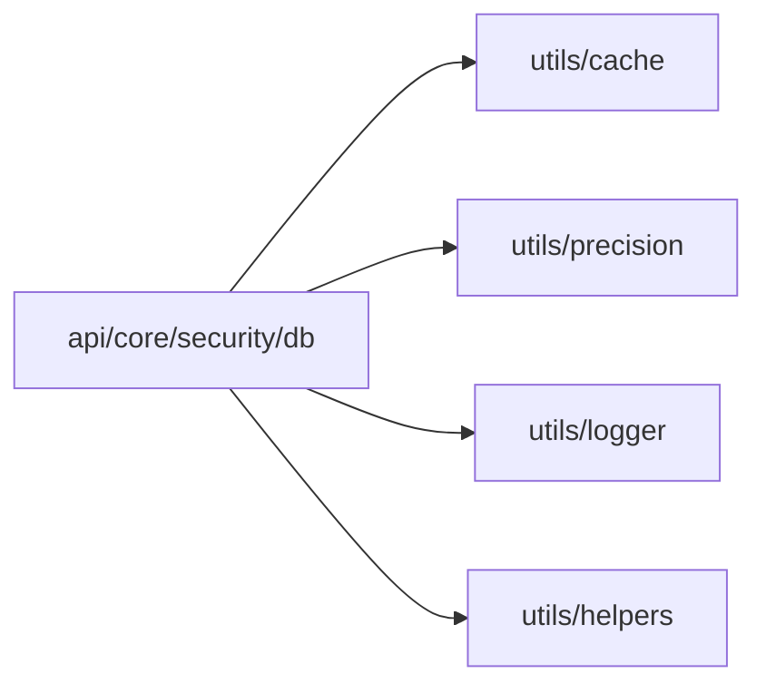

## 12. دليل المطور

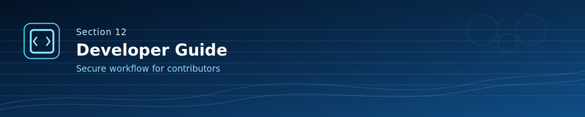

### 12.1 سير العمل اليومي

1. سحب آخر تحديث من `main` والتحقق من البيئة.
2. تنفيذ التغيير ضمن أضيق وحدة ممكنة.
3. إضافة/تحديث الاختبارات.
4. تشغيل البوابات الصارمة قبل أي PR.
5. تحديث التوثيق وCHANGELOG عند تغير السلوك.

### 12.2 البوابات المحلية الإلزامية

```bash
cargo fmt --all -- --check
cargo clippy --workspace --all-targets --all-features -- -D warnings
cargo test --workspace --all-targets --all-features
cargo audit --deny warnings
```

### 12.3 إضافة Endpoint جديد بطريقة آمنة

1. إنشاء handler داخل `src/api/`.
2. تسجيل المسار في `src/api/mod.rs`.
3. المرور عبر التفويض المركزي `authorize_request`.
4. وضع منطق المجال داخل `src/core/` وليس داخل handler.
5. استخدام `src/db/` عبر حدود CRUD المعتمدة.
6. إضافة اختبار تكاملي في `tests/`.

### 12.4 قائمة تحقق أمنية للمطور

- عدم وضع أسرار ثابتة داخل الكود.
- الإبقاء على JWT والسياسات وتحديد المعدل بشكل مركزي.
- التحقق من المدخلات قبل أي معالجة حساسة.
- تفضيل المنطق الحتمي القابل للتدقيق.
- تسجيل العمليات الحساسة بشكل واضح وقابل للمراجعة.

## 13. دور الذكاء الاصطناعي والاستخبارات

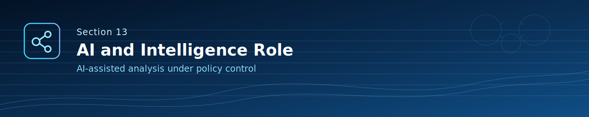

المعمارية الحالية في 2.0.1 حتمية وقابلة للتدقيق الأمني. دور الذكاء الاصطناعي هنا طبقة مساعدة تحليلية، وليس جهة إنفاذ مستقلة.

### 13.1 الوضع الحالي في 2.0.1

- قرارات الوصول والتنفيذ مبنية على سياسات صريحة ومحركات تحقق حتمية.
- تحليل الشذوذ والسلوك يتم ضمن منطق واضح قابل للتتبع.
- لا يسمح لأي مكون AI غامض بتجاوز سياسات الأمان.

### 13.2 حدود دمج AI بشكل آمن

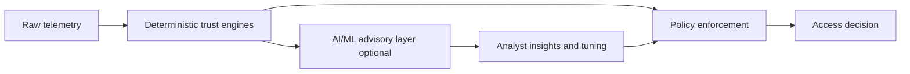

### 13.3 نموذج الاستخدام المقترح

- استخدام AI لشرح المخاطر ودعم المحللين وتوصيات ضبط العتبات.
- إبقاء الإنفاذ النهائي تحت `src/security/` و`src/core/`.
- فصل تسجيل مخرجات AI الاستشارية عن مخرجات الإنفاذ الحتمي.

## الترخيص

Apache-2.0. راجع `LICENSE`.
