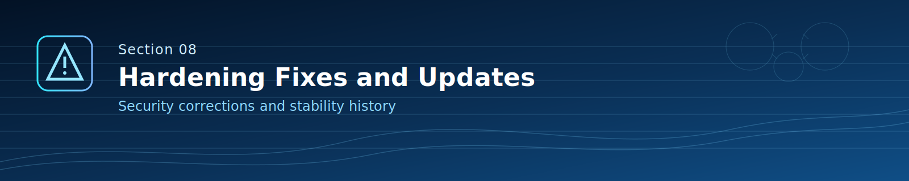

# MKT_KSA_Geolocation_Security

نظام تحقق جغرافي وأمني متقدم للإنتاج، مخصص لخدمات Rust ومنصات الوصول الذكي.

[](https://github.com/mktmansour/MKT-KSA-Geolocation-Security/actions/workflows/rust.yml)
[](https://github.com/mktmansour/MKT-KSA-Geolocation-Security/actions/workflows/clippy.yml)
[](https://crates.io/crates/MKT_KSA_Geolocation_Security)
[](https://docs.rs/MKT_KSA_Geolocation_Security)
[](https://crates.io/crates/MKT_KSA_Geolocation_Security)

## آخر التحديثات والتنبيه الاستراتيجي (2026-03-15)

- الإصدار المستهدف حاليًا هو **2.0.1** بسبب الإصلاحات الأمنية والهندسية.
- تم إكمال التقوية الأمنية والتنظيف المعماري على فرع `main`.
- مسار قاعدة البيانات التشغيلي أصبح SQLite محصنًا (`tokio-rusqlite`) مع ترحيلات (migrations).
- تم توحيد التحقق JWT وتحديد المعدل لجميع مسارات API بشكل مركزي.
- تم حذف وحدة Dashboard والوثائق القديمة المتضاربة لتقليل الانحراف الأمني/التوثيقي.
- تم اعتماد نهج نظافة مستودع صارم مع خريطة أدوار ملفات محدثة.

## سياسة الصيانة (مهم)

- هذا المستودع دخل وضع **صيانة أمنية فقط**.
- **لا يوجد تطوير ميزات جديدة** لهذا المشروع.
- التحديثات القادمة هنا ستكون فقط: إصلاحات أمنية وتصحيحات استقرار حرجة.
- يجري تجهيز مشروع خليفة أكثر سيادة (وبتبعيات خارجية أقل)، وسيتم الإعلان عنه قريبًا.

## ملاحظة مجتمعية

- تم تحميل الحزمة آلاف المرات.
- مستوى التفاعل (تعليقات/ردود/تقييمات) أقل بكثير من المتوقع.
- الملاحظات التقنية الأمنية من المستخدمين مرحب بها بشكل كبير.

## المحتويات

- [1. وظيفة المشروع](#1-وظيفة-المشروع)
- [2. الوضع التشغيلي والأمني](#2-الوضع-التشغيلي-والأمني)
- [3. خريطة أدوار المستودع كاملة](#3-خريطة-أدوار-المستودع-كاملة)
- [4. الترابط وتدفق التحكم](#4-الترابط-وتدفق-التحكم)
- [5. مرجع API وطرق الاستدعاء](#5-مرجع-api-وطرق-الاستدعاء)
- [6. متغيرات البيئة](#6-متغيرات-البيئة)
- [7. البناء والتشغيل والتحقق](#7-البناء-والتشغيل-والتحقق)
- [8. آخر الإصلاحات والتقويات](#8-آخر-الإصلاحات-والتقويات)
- [9. الاستخدام كمكتبة و C-ABI](#9-الاستخدام-كمكتبة-و-c-abi)

## 1. وظيفة المشروع


`MKT_KSA_Geolocation_Security` يجمع عدة إشارات ثقة ضمن قرار أمني موحّد:

- التحقق الجغرافي
- تحليل الشذوذ السلوكي
- تحليل بصمة الجهاز
- تحليل مخاطر الشبكة (Proxy/VPN)
- تحليل شذوذ بيانات الحساسات
- تدقيق اتساق الطقس مع السياق
- تحقق وصول ذكي مركب

طبقة API تعمل عبر Actix Web، بينما المحركات الأساسية قابلة لإعادة الاستخدام كمكتبة Rust.

## 2. الوضع التشغيلي والأمني


- اللغة: Rust 2021
- إطار الويب: Actix Web
- runtime غير متزامن: Tokio
- قاعدة البيانات التشغيلية: SQLite فقط (`DATABASE_URL=sqlite://...`)
- JWT: فك/تحقق مركزي عبر `JwtManager`
- Rate Limiting: فحص مركزي لكل IP قبل تنفيذ منطق المسار
- أسرار المحركات الداخلية: تُولَّد عشوائيًا أثناء التشغيل (بدون أي مفاتيح ثابتة داخل الكود)
- إدارة الأسرار: `secrecy` + `zeroize`
- التوقيع: HMAC-SHA512/HMAC-SHA384
- ترحيلات القاعدة: SQL versioned في `src/db/migrations`

## 3. خريطة أدوار المستودع كاملة


### ملفات الجذر

| المسار | الدور |
|---|---|
| `Cargo.toml` | تعريف الحزمة والتبعيات والميزات وأنواع البناء |
| `Cargo.lock` | تثبيت نسخ التبعيات بشكل حتمي |
| `rust-toolchain.toml` | حوكمة نسخة Rust و MSRV |
| `README.md` | التوثيق الأساسي بالإنجليزية |
| `README_AR.md` | التوثيق الأساسي بالعربية |
| `SECURITY.md` | سياسة الإبلاغ الأمني |
| `CHANGELOG.md` | سجل الإصدارات والتعديلات |
| `CONTRIBUTING.md` | دليل المساهمة والمعايير |
| `Dockerfile` | بناء صورة التشغيل بالحاوية |
| `audit.toml` | إعدادات `cargo-audit` |
| `cbindgen.toml` | إعداد توليد رؤوس C-ABI |
| `.env.example` | نموذج متغيرات البيئة |
| `GeoLite2-City-Test.mmdb` | قاعدة بيانات GeoIP تجريبية للاختبارات |

### المجلدات

| المجلد | الدور |
|---|---|
| `.github/` | CI/CD و CodeQL وحوكمة المراجعات |
| `docs/` | تقارير التقوية الأمنية وحوكمة الملفات |
| `examples/` | أمثلة استخدام المكتبة |
| `scripts/` | سكربتات الصيانة و CI |
| `src/` | الكود الإنتاجي الرئيسي |
| `tests/` | اختبارات التكامل وسطح الأمان |
| `target/` | مخلفات بناء محلية (ليست مصدرًا) |

### تفصيل `src/`

| المسار | الوظيفة | الترابط |
|---|---|---|
| `src/main.rs` | تهيئة التطبيق وتشغيل الخادم | يبني `AppState` ويسجل المسارات |
| `src/lib.rs` | واجهة المكتبة وإعادة التصدير | يعرّض `api/core/db/security/utils` |
| `src/app_state.rs` | الحالة المشتركة وقت التشغيل | يتم حقنها داخل كل handlers |
| `src/api/mod.rs` | تسجيل المسارات + مصادقة مركزية | يستدعي الوحدات الفرعية |
| `src/api/*.rs` | handlers حسب المجال | تستخدم `authorize_request` ثم core/db |
| `src/core/*.rs` | المحركات والتحليل الدوميني | تُستهلك من API والاختبارات |
| `src/db/mod.rs` | ربط وحدات قاعدة البيانات | يعرّض models/crud/migrations |
| `src/db/models.rs` | نماذج البيانات | تُستخدم في CRUD وAPI |
| `src/db/crud.rs` | عمليات SQLite | تُستخدم في auth/alerts/bootstrapping |
| `src/db/migrations.rs` + SQL | إدارة نسخة المخطط | تُنفذ عند الإقلاع |
| `src/security/*.rs` | JWT, policy, ratelimit, validation, secrets/signing | مستخدمة عرضيًا عبر المشروع |
| `src/utils/*.rs` | أدوات مساعدة رياضية/كاش/تسجيل | دعم عام للمحركات |

## 4. الترابط وتدفق التحكم


1. `main.rs` يحمّل الإعدادات ويتحقق من القيم الأمنية الحرجة (`JWT_SECRET`, DB policy).
2. `main.rs` يهيّئ كل المحركات والخدمات ويبني `AppState`.
3. الطلب يصل إلى `/api/...` عبر المسارات المسجلة في `src/api/mod.rs`.
4. `authorize_request()` يفرض بالتسلسل:
   - وجود `Authorization: Bearer ...`
   - فحص معدل الطلبات
   - فك والتحقق من JWT
5. يتم تمرير الطلب للمحرك/القاعدة المناسبة.
6. تعاد الاستجابة JSON أو خطأ HTTP مناسب.

## 5. مرجع API وطرق الاستدعاء


Base URL: `http://127.0.0.1:8080`
جميع المسارات تحت `/api`.
كل المسارات تتطلب: `Authorization: Bearer <JWT>`.

### 5.1 جدول المسارات

| الطريقة | المسار | الملف | الوظيفة |
|---|---|---|---|
| `GET` | `/api/users/{id}` | `src/api/auth.rs` | جلب مستخدم بـ UUID (self/admin) |
| `POST` | `/api/geo/resolve` | `src/api/geo.rs` | تحقق جغرافي متقاطع |
| `POST` | `/api/device/resolve` | `src/api/device.rs` | تحليل بصمة الجهاز |
| `POST` | `/api/behavior/analyze` | `src/api/behavior.rs` | تحليل مخاطر السلوك |
| `POST` | `/api/sensors/analyze` | `src/api/sensors.rs` | تحليل شذوذ الحساسات |
| `POST` | `/api/network/analyze` | `src/api/network.rs` | تحليل الشبكة وكشف الإخفاء |
| `POST` | `/api/alerts/trigger` | `src/api/alerts.rs` | إنشاء وتخزين تنبيه أمني |
| `POST` | `/api/weather/summary` | `src/api/weather.rs` | ملخص تحقق الطقس |
| `POST` | `/api/smart_access/verify` | `src/api/smart_access.rs` | قرار وصول ذكي مركب |

### 5.2 أمثلة استدعاء

جلب مستخدم:

```bash
curl -X GET "http://127.0.0.1:8080/api/users/<uuid>" \
  -H "Authorization: Bearer <jwt>"
```

تحقق جغرافي:

```bash
curl -X POST "http://127.0.0.1:8080/api/geo/resolve" \
  -H "Authorization: Bearer <jwt>" \
  -H "Content-Type: application/json" \
  -d '{
    "ip_address":"8.8.8.8",
    "gps_data":[24.7136,46.6753,8,1.0],
    "os_info":"ios",
    "device_details":"iphone-15",
    "environment_context":"mobile-4g",
    "behavior_input":{
      "user_id":"00000000-0000-0000-0000-000000000000",
      "event_type":"login",
      "ip_address":"8.8.8.8",
      "device_id":"device-1",
      "timestamp":"2026-03-15T00:00:00Z"
    }
  }'
```

تحليل الشبكة:

```bash
curl -X POST "http://127.0.0.1:8080/api/network/analyze" \
  -H "Authorization: Bearer <jwt>" \
  -H "Content-Type: application/json" \
  -d '{"ip":"1.1.1.1","conn_type":"WiFi"}'
```

إطلاق تنبيه:

```bash
curl -X POST "http://127.0.0.1:8080/api/alerts/trigger" \
  -H "Authorization: Bearer <jwt>" \
  -H "Content-Type: application/json" \
  -d '{
    "entity_id":"00000000-0000-0000-0000-000000000000",
    "entity_type":"user",
    "alert_type":"suspicious_login",
    "severity":"high",
    "details":{"ip":"8.8.8.8","reason":"impossible_travel"}
  }'
```

تحقق الوصول الذكي:

```bash
curl -X POST "http://127.0.0.1:8080/api/smart_access/verify" \
  -H "Authorization: Bearer <jwt>" \
  -H "Content-Type: application/json" \
  -d '{
    "geo_input":["8.8.8.8",[24.7136,46.6753,8,1.0]],
    "behavior_input":{
      "user_id":"00000000-0000-0000-0000-000000000000",
      "event_type":"entry_attempt",
      "ip_address":"8.8.8.8",
      "device_id":"device-1",
      "timestamp":"2026-03-15T00:00:00Z"
    },
    "os_info":"ios",
    "device_details":"iphone-15",
    "env_context":"office-gate"
  }'
```

## 6. متغيرات البيئة


| المتغير | إلزامي | الوصف | مثال |
|---|---|---|---|
| `API_KEY` | نعم | مفتاح التطبيق في طبقة الإعداد | `API_KEY=change_me` |
| `JWT_SECRET` | نعم | سر JWT بطول 32+ | `JWT_SECRET=32+_chars_secret_here` |
| `DATABASE_URL` | موصى به | مسار SQLite؛ بدونه تعيد مسارات DB حالة 503 | `DATABASE_URL=sqlite://data/app.db` |
| `BOOTSTRAP_ADMIN_PASSWORD_HASH` | اختياري | عند ضبطه يتم إنشاء مستخدم bootstrap-admin عند الإقلاع بالهاش الممرر | `BOOTSTRAP_ADMIN_PASSWORD_HASH=<argon2_hash>` |
| `LOG_LEVEL` | اختياري | مستوى السجلات | `LOG_LEVEL=info` |
| `GEO_PROVIDER` | اختياري | اختيار مزود الموقع | `GEO_PROVIDER=ipapi` |

## 7. البناء والتشغيل والتحقق


```bash
cargo fmt --all -- --check
cargo clippy --all-targets --all-features -- -D warnings
cargo test --all
```

تشغيل:

```bash
API_KEY=change_me \
JWT_SECRET=replace_with_a_long_secret_32_chars_min \
DATABASE_URL=sqlite://data/app.db \
BOOTSTRAP_ADMIN_PASSWORD_HASH=replace_with_hash_if_needed \
cargo run
```

## 8. آخر الإصلاحات والتقويات



نطاق الإصلاحات والتطويرات في 2.0.1 يشمل بشكل كامل:

- التقوية الأمنية:
- اعتماد SQLite المحصن فقط مع فرض الترحيلات.
- توحيد التحقق JWT وتحديد المعدل لكل IP عبر مسار مصادقة مركزي.
- توليد أسرار المحركات داخليًا وقت التشغيل وإلغاء أي أسرار ثابتة داخل الكود.
- جعل seed لمستخدم bootstrap-admin اختياريًا فقط عبر `BOOTSTRAP_ADMIN_PASSWORD_HASH`.
- الإصلاحات التشغيلية:
- حذف وحدة Dashboard بالكامل من سطح API.
- استبدال السلوك الوهمي في بعض المسارات بمنطق فعلي مربوط بالمحركات/القاعدة.
- إضافة مخزن تنبيهات في الذاكرة بحد أعلى لمنع التضخم.
- الحوكمة ونظافة المستودع:
- إزالة التقارير القديمة غير المتوافقة مع الوضع الحالي.
- إضافة وثيقة مرجعية نهائية لأدوار الملفات.
- إعادة بناء التوثيقين الأساسيين (إنجليزي/عربي) بصياغة هندسية صارمة.
- إضافة بنرات رسومية لكل قسم لعرض أكثر احترافية واتزانًا.
- التحقق والجودة:
- نجاح فحوص `fmt` و`clippy -D warnings` و`test` على مسار هذا التحديث.

تم توثيق التحديثات الأمنية والهندسية الحديثة في:

- `docs/SECURITY_HARDENING_2026-03-15.md`
- `docs/GITHUB_ADVANCED_SCAN_2026-03-15.md`
- `docs/REPOSITORY_FILE_ROLES_2026-03-15.md`
- `CHANGELOG.md`

## 9. الاستخدام كمكتبة و C-ABI


أنواع التصدير المدعومة:

- `rlib` (استخدام Rust مباشر)
- `cdylib` (مكتبة ديناميكية متوافقة C)
- `staticlib` (مكتبة ثابتة متوافقة C)

وهذا يدعم التكامل المباشر مع Rust وكذلك الربط متعدد اللغات.

## الترخيص

Apache-2.0. راجع `LICENSE`.
