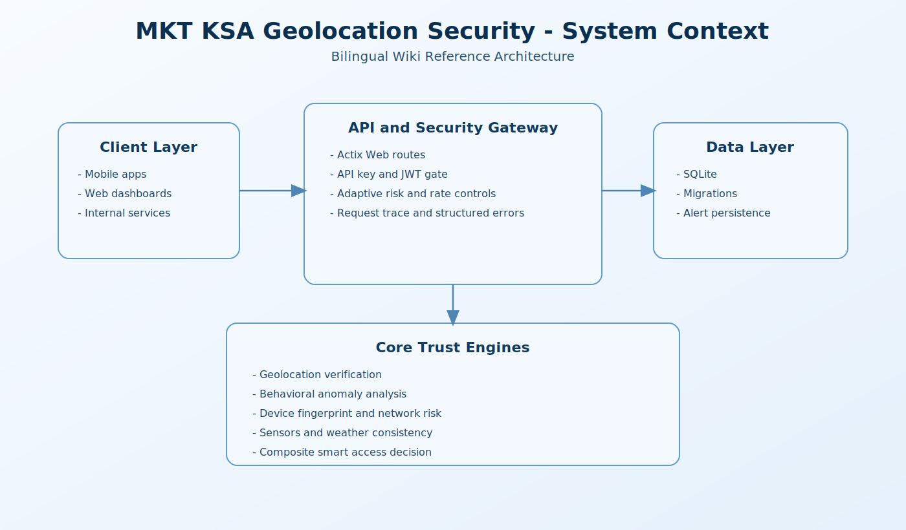
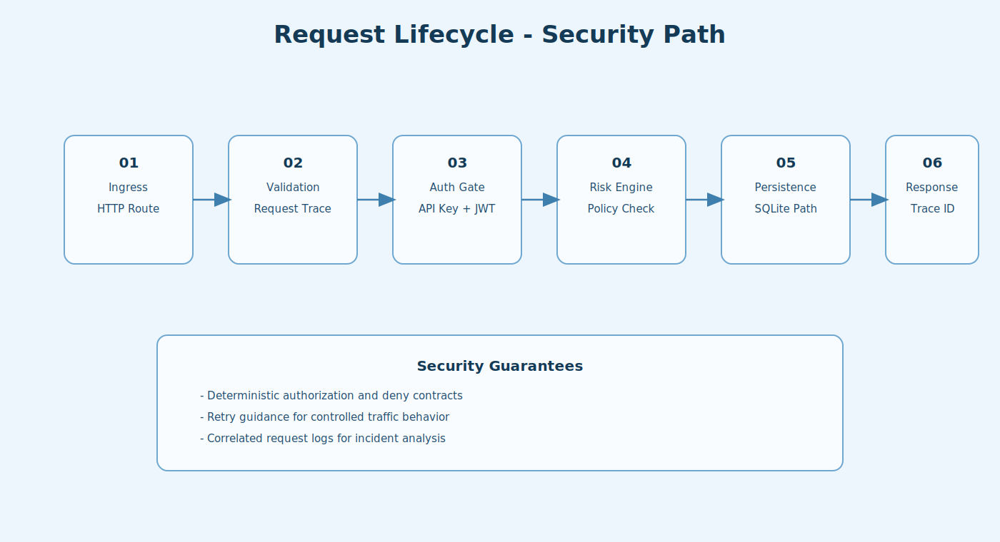
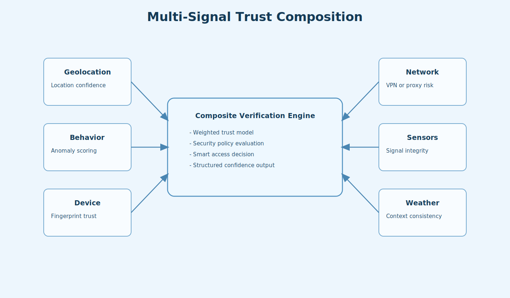
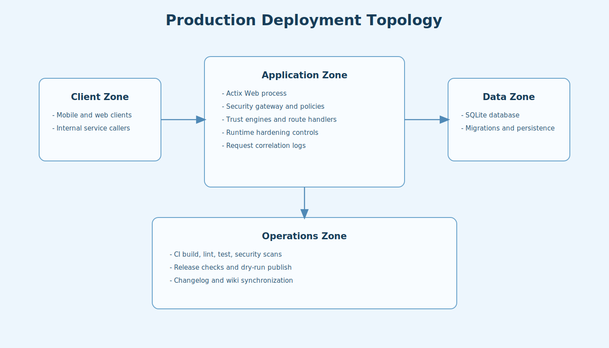

# 02. Architecture

This page explains how the project is structured from core engines to API surface.

## 1. Architecture Layers

- Interface layer: HTTP API endpoints in src/api.
- Security gate layer: API key, JWT, adaptive risk logic, and rate controls.
- Core intelligence layer: geo, behavior, device, network, sensors, weather.
- Persistence layer: SQLite access and migration flow in src/db.
- Utility and observability layer: logging, helpers, cache, precision.

## 2. Request Lifecycle

1. Request enters Actix Web route.
2. Validation and request correlation are applied.
3. Authorization path evaluates API key and JWT.
4. Security engines calculate risk and policy outcomes.
5. Handler persists data when required.
6. Response returns with deterministic envelope and trace context.

## 3. Trust-Signal Composition

Signal domains:

- Geolocation consistency.
- Behavioral anomaly scoring.
- Device fingerprint confidence.
- Network concealment risk.
- Sensor integrity signals.
- Weather-context consistency.

Composite verification combines these domains to produce smart access decisions.

## 4. Key Runtime Components

- App wiring: src/main.rs and src/app_state.rs.
- Routing and auth gate: src/api/mod.rs.
- Core engines: src/core/*.rs.
- Security modules: src/security/*.rs.
- DB models and migrations: src/db/*.rs and src/db/migrations.

## 5. Deployment Topology

- External clients call API.
- API service enforces security and computes trust decisions.
- SQLite stores operational data and alerts.
- Logs/metrics support audit and incident triage.

## 6. Next Step

Continue to [03. Security Deep Dive](03-Security-Deep-Dive.md).

## Search Keywords

Rust security architecture, geolocation trust engine design, multi-signal risk model, secure API gateway architecture.
